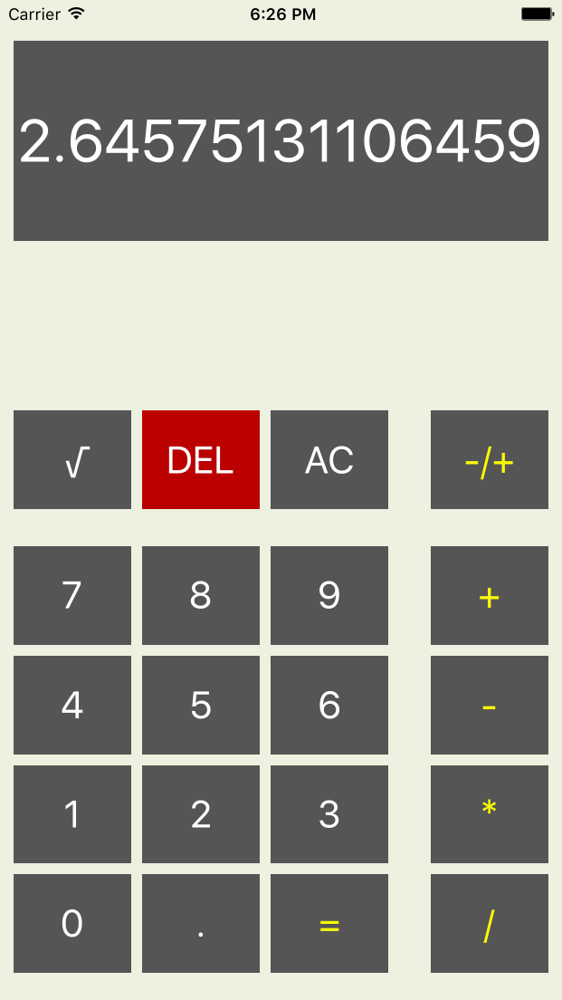
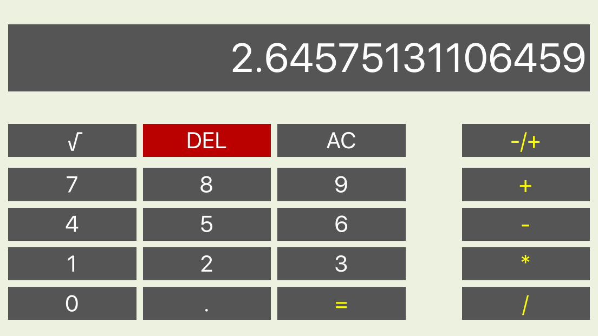

# CalC (iOS - Swift)

A calculator app that mimics a handheld calculator written in Swift 2.0

Basic Calculator Functions :

- Addition        +
- Subtraction     -   
- Multiplication  *
- Division        /
- Square Root     √

Other Features : 

- Positive and Negative numbers are supported
- Decimal values are also supported
- Lanscape and Potrait Orientation supported

# Screenshots

Potrait Layout

 

Landscape Layout

 

# Requirements

- Xcode 7.2
- iOS 9

